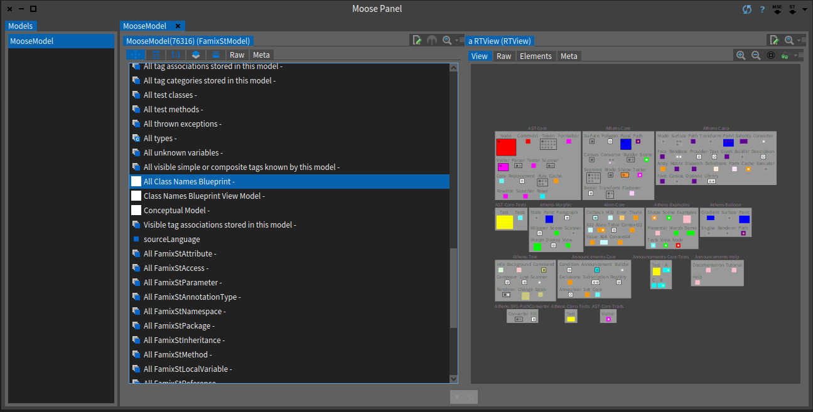

# ClassNameAnalyser

[](https://travis-ci.org/NourDjihan/ClassNameAnalyser)
[](https://ci.appveyor.com/project/NourDjihan/classnameanalyser)
[](https://coveralls.io/github/NourDjihan/ClassNameAnalyser?branch=master)
[](https://raw.githubusercontent.com/NourDjihan/ClassNameAnalyser/master/LICENSE)

## Installation

In order to install this project, execute (Do-it, Ctrl+D) the following script in the Playground of your Moose 8 Image

```Smalltalk
Metacello new
  baseline: 'ClassNameAnalyser';
  repository: 'github://NourDjihan/ClassNameAnalyser/src';
  load.
```
## ClassNameAnalyser Description:
The **ClassNameAnalyser** is a visualisation of the distribution of concepts in a specific **Java** or **Pharo** project using the *ClassNames Blueprint*. The distribution of concepts in the project starts from the simple hypothesis: most Programmers use english as their programming language so when naming their classes, the standard format of the class name has the concept written at the end of the word (the suffix of the word). For example a class named: `ClassNameAnalyser`, the concept is at the end of the word which is `Analyser`. Indeed, the main goal of the visualisation is to helpt detect inconsistencies in the system by analysing class naming conventions.

## How to use the ClassNameAnalyser With Moose
After loading the *ClassNameAnalyser*, load your project/packages into your Moose Panel, scroll to see the **ClassNames Blueprint** visualisation, the **conceptual model**, the **view model** and all the **root models** (all hierarchies) of your packages. The Moose Panel has the option of loading Java projects, but first one must create the .mse file of the java project so it can be loaded and analysed.

In case you are not familiar with Moose, or do not know how to create .mse file of your java project, I suggest you have a look at the [Moose Book](http://www.themoosebook.org/book/).

## Understanding your Visualisation:
THe visualisation uses boxes to wrap up packages, which contain concept boxes that also wrap up class boxes belonging to the package and having the concept name as a suffix of the class name.
ClassNameAnalyser is a representation of the ClassNames Blueprint. The ClassNames Blueprint is based on these simples conventions in the table below:

Class Type | Description | Color
--- | --- | --- |
**Mono Class** | a class which belongs to no hierarchy | white
**Trait Class** | a class containing a set of methods that can be used to extend the functionality of a class | white
**Mono Suffix Hierarchy** | Hierarchies which use the same naming convention (uses the same suffix in all classes) | Gray
**Multi Suffix Hierarchy** | Hierarchies which do not use the same naming convention (uses different suffixes throughout the tree hierarchy) | Selects a color from the palette (24 biggest hierarchies use 24 colors in the palette)
**Other hierarchies** | starting from the 25th biggest hierarchy in the system | Black

Class boxes are colored the same as their root class, while concept boxes are colored the same as the biggest hierarchy which uses the concept's name (suffix)

## A Visual Example:
The visualisation below represents a ClassNames Blueprint for some packages selected from the Moose Image by clicking on the 'st' option as shown in the above-right of the Moose Panel:

The visualisation below represents a ClassNames Blueprint for a [Java project(ArgoUML)](https://github.com/argouml-tigris-org) imported as an .mse file by clicking on the 'mse' option as shown in the above-right of the Moose Panel:


