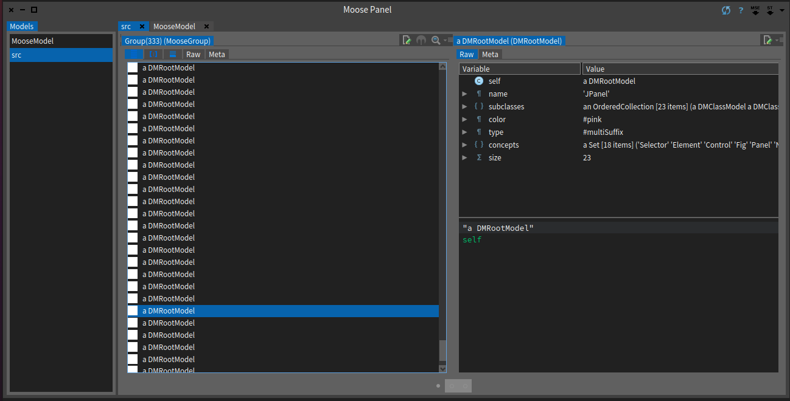

# ClassNameAnalyser

[](https://travis-ci.org/NourDjihan/ClassNameAnalyser)
[](https://ci.appveyor.com/project/NourDjihan/classnameanalyser)
[](https://coveralls.io/github/NourDjihan/ClassNameAnalyser?branch=master)
[](https://raw.githubusercontent.com/NourDjihan/ClassNameAnalyser/master/LICENSE)

## Installation

In order to install this project, execute (Do-it, Ctrl+D) the following script in the Playground of your Moose 8 Image

```Smalltalk
Metacello new
  baseline: 'ClassNameAnalyser';
  repository: 'github://NourDjihan/ClassNameAnalyser/src';
  load.
```
## ClassNameAnalyser Description:
The **ClassNameAnalyser** is a visualisation of the distribution of concepts in both **Java** and **Pharo** projects using the *ClassNames Blueprint*. The distribution of concepts in projects starts from the simple hypothesis: most programmers use english when writing code hence, when naming their classes, the standard format of the class name usually has the concept written at the end of the word (as a suffix). for instinct, when you read the project name, your mind quickly undertsood its functionality which is analysing. An example of a class name written in english could be: `ConceptualModel`, could you guess what the class might represent? Indeed! it is a model (it's okey if you didn't guess it, you might have been programming in an other language other than english or ... not at all). However, analysing class naming conventions is the main goal of this project, in fact *the ClassNames Blueprint* prooved to be helpful in detecting some inconsistencies in the system's naming convention. Furthermore, it shows the system's main concepts and their locations.

## How to use the ClassNameAnalyser With Moose
After loading the *ClassNameAnalyser*, load your project/packages into the Moose Panel, you'll see all the **root models** (all hierarchies) of your packages ,scroll to see the **ClassNames Blueprint** visualisation, the **conceptual model** and the **view model**. The Moose Panel has the option of loading Java projects, but first one must create the .mse file of the java project so it can be loaded and analysed.

In case you are not familiar with Moose, or do not know how to create .mse file of your java project, I suggest you have a look at the [Moose Book](http://www.themoosebook.org/book/).

## Understanding your Visualisation:
THe visualisation uses boxes to wrap up packages, which contain concept boxes that also wrap up class boxes belonging to the package and having the concept's box  name as a suffix of the class name.
*ClassNameAnalyser* is a representation of the ClassNames Blueprint. The ClassNames Blueprint is based on these simples conventions in the table below:

Class Type | Description | Color
--- | --- | --- |
**Mono Class** | a class which belongs to no hierarchy | white
**Trait Class** | a class containing a set of methods that can be used to extend the functionality of a class | white
**Mono Suffix Hierarchy** | Hierarchies which use the same naming convention (all classes of a tree hierarchy have the same suffix) | Gray
**Multi Suffix Hierarchy** | Hierarchies that do not use the same naming convention | Selects a color from the palette (24 biggest hierarchies use 24 colors in the palette)
**Other hierarchies** (*ignored*) | starting from the 25th biggest hierarchy in the system | Black

Class boxes are colored the same as their root class, while concept boxes are colored the same as the biggest hierarchy which uses the concept's name (suffix)

## A Visual Example:
The visualisation below represents a ClassNames Blueprint 

some packages selected from the Moose Image by clicking on the 'st' option as shown in the above-right of the Moose Panel:


The visualisation below represents a ClassNames Blueprint for a [Java project(ArgoUML)](https://github.com/argouml-tigris-org) imported as an .mse file by clicking on the 'mse' option as shown in the above-right of the Moose Panel:
.png)

Figure below depicts the grouo of Root Models of the ArgoUML Java project and an example of a root model:



