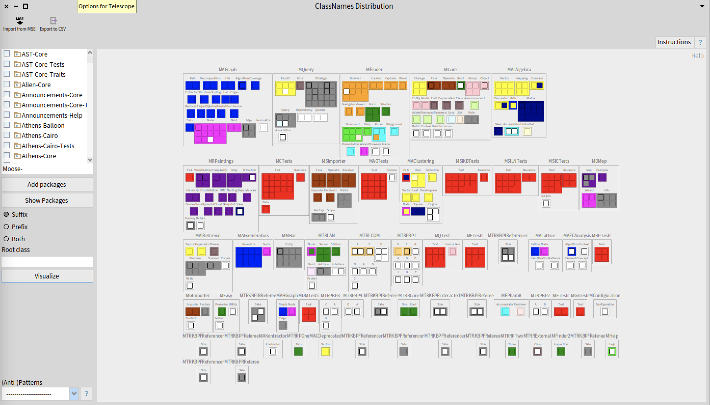
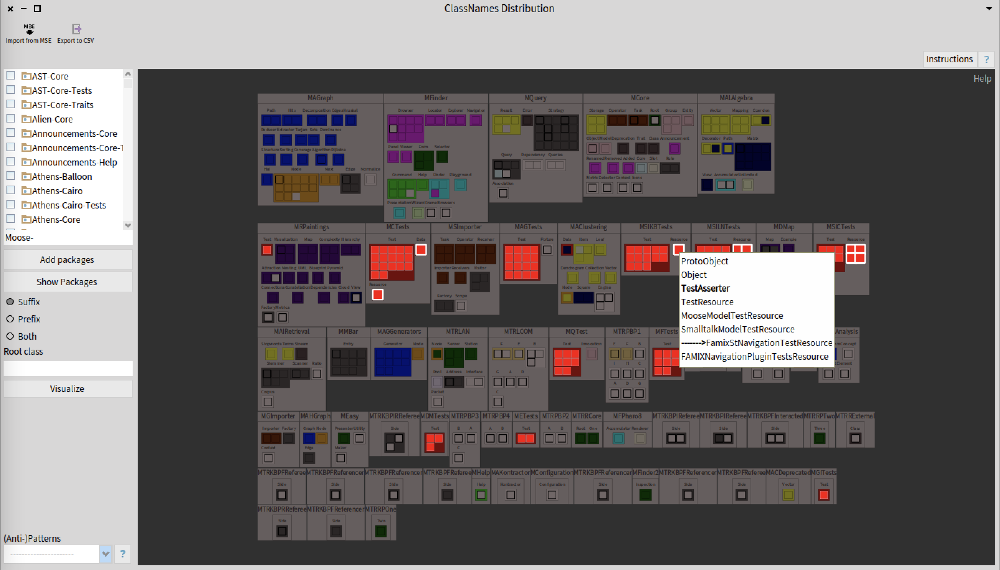
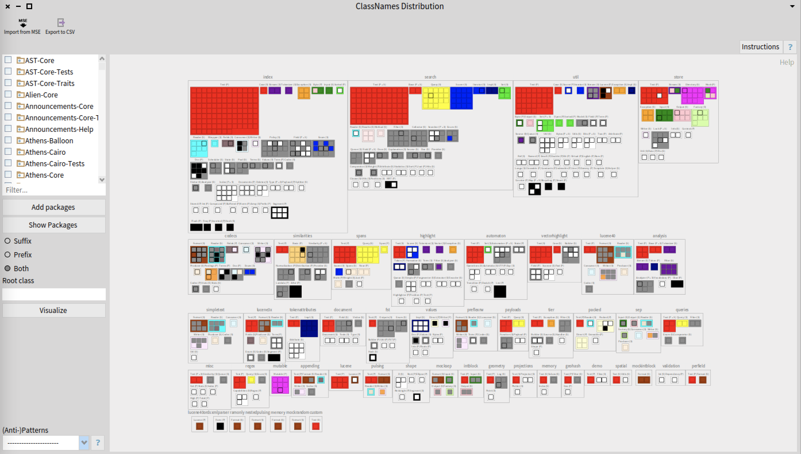

# ClassNameAnalyser


## Installation

In order to install this project, execute (Do-it, Ctrl+D) the following script in the Playground of your Moose 9 Image

```Smalltalk
Metacello new
  baseline: 'ClassNameAnalyser';
  repository: 'github://NourDjihan/ClassNameAnalyser/src';
  load.
```
## ClassNameAnalyser Description:
The **ClassNameAnalyser** is a project which provides a visualisation of the distribution of concepts in both **Java** and **Pharo**. The visualization is called *ClassName Distribution*. Full demo in: https://drive.google.com/drive/folders/1C0r1-R_6EYxqJS528pLuvKbYQF_Q5MjV?usp=sharing


## How to use the ClassNameAnalyser
After loading the *ClassNameAnalyser*, click on *Library* from the top menu then select *ClassNames Distribution*.
For Pharo projects, you can write the name of the project in the list of packages on the left side, then use the shortcut cmd+A to select all packages starting with the project name.
For Java projects, you may want to create an mse file first using: https://github.com/moosetechnology/VerveineJ. Then load your mse file from the mse icon on the top left of the tool.

Once you project is selected/loaded, click on the visualize button.

## Understanding your Visualisation:
The visualization is based on:
- Package boxes that contain suffixes/prefixes of class names. Where each suffix/prefix box holds the classes using it.
- Colors: a color represents a hierarchy:

Class Type | Description | Color
--- | --- | --- |
**Mono Class** | a class which belongs to no hierarchy | white
**Trait Class** | a class containing a set of methods that can be used to extend the functionality of a class | white
**Mono Suffix Hierarchy** | Hierarchies which use the same naming convention (all classes of a tree hierarchy have the same suffix) | Gray
**Multi Suffix Hierarchy** | Hierarchies that do not use the same naming convention | a color is selected from the predefined color palette (24 main colors taken by the first biggest 24 hierarchies in descending order)
**Other hierarchies** (*ignored*) | starting from the 25th biggest hierarchy in the system | Black


## A Visual Example:
The figure below depicts a *ClassNames Distribution* of the [Moose](https://github.com/moosetechnology/Moose) project:


You have all the informations about the approach and how to manipulate the tool in the instructions + ? buttons.
You can also highlight classes of the same hierarchy to see their distribution in packages and select an item from the (anti-)patterns list (bottom left) to help detecting inconsistencies in class names.


The visualisation below shows a *ClassNames Distribution* the Lucene project 2004. For Java projects it is better to select both suffix/prefix since they do not follow the suffix naming convention, the concept is usually droped either at the beginning or the end of the class name.



